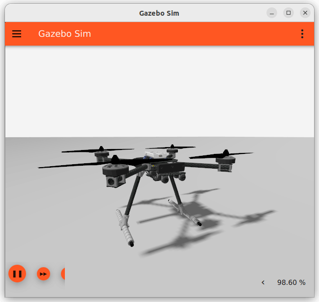
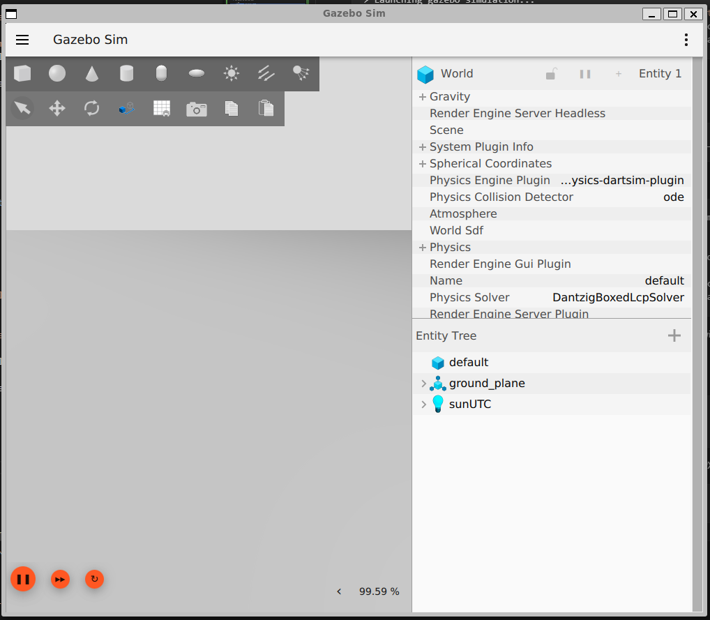
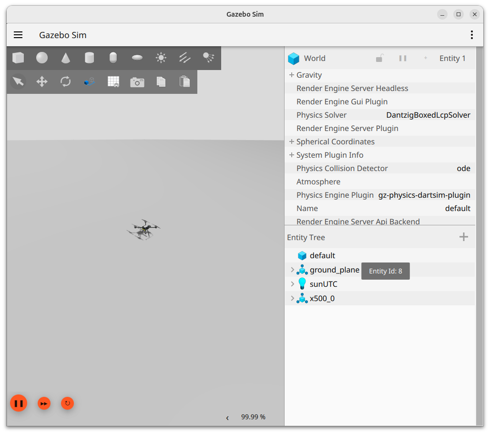
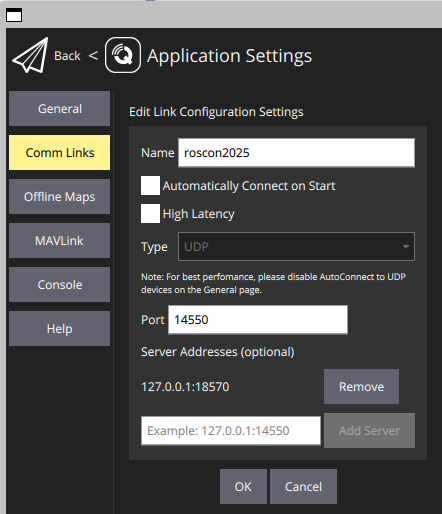
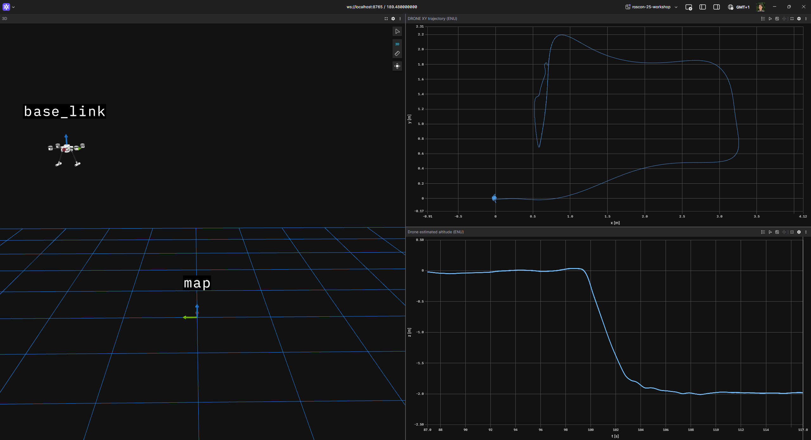

# Setup

This page will guide you through the installation of the requirements for running the workshop exercises and it will explain how ROS 2, Gazebo and PX4 will interact.

The images contains all the required dependencies for the workshop, in particular:

- [GZ HARMONIC](https://gazebosim.org/docs/harmonic/getstarted/)
- [ROS 2 Jazzy](https://docs.ros.org/en/jazzy/index.html)
- [PX4](https://github.com/PX4/PX4-Autopilot) v1.17.0 simulator

## Prerequisites

All the instructions and all the provided scripts have been tested on Ubuntu 24.04.

- **QGroundControl**. [GQC](https://qgroundcontrol.com/) provides intuitive operator control of PX4 drones, it lets you configure PX4, calibrate the drone sensors and plan mission.
QGC is already installed in the Docker images.
However, it requires GUI to enabled for the container.
If this is not possible (currently for MAC) then QGC will have to be installed on the host system.
- **Foxglove**. [Foxglove](https://foxglove.dev/download) will make visualizing the drone state and perceived environment a more user friendly way.


### PX4 SITL

Refer to [PX4 Gazebo SITL documentation](https://docs.px4.io/main/en/sim_gazebo_gz/) to clone PX4 repo, install the PX4 build dependencies, build the project and start a Gazebo Simulation.

**note**: PX4 Gazebo simulation with cameras you might encounter a memory leak due caused by the PX4 gstreamer plugin.
See https://github.com/PX4/PX4-Autopilot/issues/27296
Disable the plugin if you see it happening.

### QGroundControl

Download QGC

### ROS 2 workspace setup

1. Create a ROS 2 workspace
   
    ```bash
    mkdir -p ~/workspaces/px4_roscon26_ws/src
    cd ~/workspaces/px4_roscon26_ws/src
    git clone -b develop git@github.com:Dronecode/roscon-25-workshop.git
    ```

1. Install ROS 2 Jazzy: https://docs.ros.org/en/jazzy/Installation/Ubuntu-Install-Debs.html.
Pick `ros-jazzy-desktop`.
1. Install the ROS 2 developer tools

    ```bash
    sudo apt install ros-dev-tools
    ```

1. Clone the dependencies
   
    ```bash
    cd ~/workspaces/px4_roscon26_ws
    vcs import src < ./src/roscon-25-workshop/jazzy.repos
    ```

1. Install dependencies
   
    ```bash
    cd ~/workspaces/px4_roscon26_ws
    source /opt/ros/jazzy/setup.bash
    rosdep install -i --from-paths src --skip-keys OpenCV
    ```

1. Build the workspace
   
    ```bash
    cd ~/workspaces/px4_roscon26_ws
    source /opt/ros/jazzy/setup.bash
    colcon build --symlink-install
    ```


### TO-DO: update everything below this point

## How to start the simulation

### Starting the PX4-GZ simulation

PX4 can directly connect to GZ using the `gz-transport` libraries.
This means that PX4 can control any GZ model as long as the model uses the required sensor and actuation plugins.

For this workshop we will use the x500 quadrotor model.



The PX4 Gazebo worlds and models are available in the `/home/ubuntu/PX4-gazebo-models` container directory.
From there you can start a GZ simulation with a PX4 compatible world:

```sh
python3 /home/ubuntu/PX4-gazebo-models/simulation-gazebo --model_store /home/ubuntu/PX4-gazebo-models/ --world default
```

- If you want to run the gz server in headless mode, add the option `--headless`.
- If you want to change the world, then change the argument of `--world`.

Note that `--headless` is mandatory when running without GUI.

The expected output when GUI is enabled is

```sh
ubuntu@fe14532c7704:~$ python3 /home/ubuntu/PX4-gazebo-models/simulation-gazebo --model_store /home/ubuntu/PX4-gazebo-models/
Found: 219 files in /home/ubuntu/PX4-gazebo-models/
Models directory not empty. Overwrite not set. Not downloading models.
> Launching gazebo simulation...
QStandardPaths: XDG_RUNTIME_DIR not set, defaulting to '/tmp/runtime-ubuntu'
[Err] [SystemLoader.cc:92] Failed to load system plugin [libOpticalFlowSystem.so] : Could not find shared library.
[Err] [SystemLoader.cc:92] Failed to load system plugin [libGstCameraSystem.so] : Could not find shared library.
```

- Please ignore the error messages about the plugins not found.
- The gazebo client window will open on the empty world.
- No PX4 model will appear.
This is normal as PX4 instance and model will be spawned in a different step.



Once the GZ server is running, you can spawn the `x500` model and attach a PX4 instance to it with

```sh
PX4_GZ_STANDALONE=1 PX4_SYS_AUTOSTART=4001 PX4_PARAM_UXRCE_DDS_SYNCT=0 /home/ubuntu/px4_sitl/bin/px4 -w /home/ubuntu/px4_sitl/romfs
```

The expected output is

```sh
$ PX4_GZ_STANDALONE=1 PX4_SYS_AUTOSTART=4001 PX4_PARAM_UXRCE_DDS_SYNCT=0 /home/ubuntu/px4_sitl/bin/px4 -w /home/ubuntu/px4_sitl/romfs
INFO  [px4] assuming working directory is rootfs, no symlinks needed.

______  __   __    ___ 
| ___ \ \ \ / /   /   |
| |_/ /  \ V /   / /| |
|  __/   /   \  / /_| |
| |     / /^\ \ \___  |
\_|     \/   \/     |_/

px4 starting.

INFO  [px4] startup script: /bin/sh etc/init.d-posix/rcS 0
env SYS_AUTOSTART: 4001
INFO  [param] selected parameter default file parameters.bson
INFO  [param] selected parameter backup file parameters_backup.bson
  SYS_AUTOCONFIG: curr: 0 -> new: 1
  SYS_AUTOSTART: curr: 0 -> new: 4001
  CAL_ACC0_ID: curr: 0 -> new: 1310988
  CAL_GYRO0_ID: curr: 0 -> new: 1310988
  CAL_ACC1_ID: curr: 0 -> new: 1310996
  CAL_GYRO1_ID: curr: 0 -> new: 1310996
  CAL_ACC2_ID: curr: 0 -> new: 1311004
  CAL_GYRO2_ID: curr: 0 -> new: 1311004
  CAL_MAG0_ID: curr: 0 -> new: 197388
  CAL_MAG0_PRIO: curr: -1 -> new: 50
  CAL_MAG1_ID: curr: 0 -> new: 197644
  CAL_MAG1_PRIO: curr: -1 -> new: 50
  SENS_BOARD_X_OFF: curr: 0.0000 -> new: 0.0000
  SENS_DPRES_OFF: curr: 0.0000 -> new: 0.0010
  UXRCE_DDS_SYNCT: curr: 1 -> new: 0
INFO  [dataman] data manager file './dataman' size is 1208528 bytes
INFO  [init] Gazebo simulator
INFO  [init] Standalone PX4 launch, waiting for Gazebo
INFO  [init] Gazebo world is ready
INFO  [init] Spawning model
INFO  [gz_bridge] world: default, model: x500_0
INFO  [lockstep_scheduler] setting initial absolute time to 2324000 us
INFO  [commander] LED: open /dev/led0 failed (22)
WARN  [health_and_arming_checks] Preflight Fail: ekf2 missing data
WARN  [health_and_arming_checks] Preflight Fail: No connection to the ground control station
INFO  [uxrce_dds_client] init UDP agent IP:127.0.0.1, port:8888
INFO  [tone_alarm] home set
INFO  [mavlink] mode: Normal, data rate: 4000000 B/s on udp port 18570 remote port 14550
INFO  [mavlink] mode: Onboard, data rate: 4000000 B/s on udp port 14580 remote port 14540
INFO  [mavlink] mode: Onboard, data rate: 4000 B/s on udp port 14280 remote port 14030
INFO  [mavlink] mode: Gimbal, data rate: 400000 B/s on udp port 13030 remote port 13280
INFO  [logger] logger started (mode=all)
INFO  [logger] Start file log (type: full)
INFO  [logger] [logger] ./log/2025-08-09/11_56_59.ulg
INFO  [logger] Opened full log file: ./log/2025-08-09/11_56_59.ulg
INFO  [mavlink] MAVLink only on localhost (set param MAV_{i}_BROADCAST = 1 to enable network)
INFO  [mavlink] MAVLink only on localhost (set param MAV_{i}_BROADCAST = 1 to enable network)
INFO  [px4] Startup script returned successfully
pxh> WARN  [health_and_arming_checks] Preflight Fail: No connection to the ground control station
WARN  [health_and_arming_checks] Preflight Fail: No connection to the ground control station
```

Let's analyze this command:

- `PX4_GZ_STANDALONE=1` tells the PX4 startup script that it will need to connect to an already running GZ server.
- `PX4_SYS_AUTOSTART=4001` tells the PX4 startup script that it has to use the `4001` _airframe_.
This airframe is defined in the [PX4 simulated airframes](https://github.com/PX4/PX4-Autopilot/tree/v1.16.0/ROMFS/px4fmu_common/init.d-posix/airframes) folder and is bound to the `x500` model.
Because not explicit model name was given, PX4 will insert the model in the GZ world.
An explicit mentioning of the model name would have made PX4 to simply connect to an already spawned model.
- `PX4_PARAM_UXRCE_DDS_SYNCT=0` disabled the [time synchronization](https://docs.px4.io/v1.16/en/ros2/user_guide#ros-gazebo-and-px4-time-synchronization) feature between ROS 2 and PX4.
Synchronization is not needed as Gazebo will control the clock for both PX4 and ROS 2.

The complete documentation for running PX4 simulation in Gazebo is part of [PX4 documentation](https://docs.px4.io/main/en/sim_gazebo_gz/).



Before taking off you just need to connect QGC to your simulated drone.
If you started you container with the GUI, then you can simply run

```sh
/home/ubuntu/QGroundControl/qgroundcontrol
```

If instead you don't have GUI in your container, then you can still run QGC on the host and attach it to the simulated PX4 instance.

To do so, first [install QGC](https://docs.qgroundcontrol.com/Stable_V5.0/en/qgc-user-guide/getting_started/download_and_install.html), then start it and create a custom UDP connection link by setting the server ip to `127.0.0.1` and the port to `18570`.



The no-gui container automatically exposed the udp port `18570` to the host.
The GUI-enable container does not expose the port so this method won't for it.

On the PX4 terminal you will see the message

```sh
INFO  [mavlink] partner IP: 172.17.0.1
INFO  [commander] Ready for takeoff!
```

This is all you need to do to start the GZ + PX4 simulation, you can now takeoff!

## Next step (optional) - Link the simulation to ROS 2

With the simulation up an running, it is time to bridge ROS 2 with Gazebo and PX4.

The following sections will demo the essential steps in this process.
However, when trying the exercises you can leverage the [common launchfile](../px4_roscon_workshop/px4_roscon_workshop/README.md) which automatically sets up the required bridges.

1. **Clock bridging.**  We want to leverage the GZ clock and use it to time all our ROS 2 node.
This is accomplished by first creating an unidirectional bridge between the gz `/clock` topic and the ROS 2 one and then by commanding all ROS 2 to use the newly created `/clock` ROS 2 topic as time reference.
We will use the `ros_gz_bridge` package to create the bridge:

    ```sh
    ros2 run ros_gz_bridge parameter_bridge /clock@rosgraph_msgs/msg/Clock[gz.msgs.Clock
    ```

    While the ROS 2 behavior will be set by the parameter `use_sim_time`.
2. **ROS 2 - PX4 bridge.** PX4 leverages [eProsima Micro XRCE-DDS](https://micro-xrce-dds.docs.eprosima.com/en/v2.4.3/) which internal [PX4 messages](https://docs.px4.io/v1.16/en/middleware/uorb) to be directly exposed to the ROS 2 network.
The simulated PX4 instance automatically start the Micro XRCE-DDS client using UDP protocol on port 8888, what we need to do is to just start the agent with the same settings.

    ```sh
    MicroXRCEAgent udp4 -p 8888
    ```

    after running this command you can see PX4 establish the connection - the expected output is a sequence of messages like

    ```sh
    INFO  [uxrce_dds_client] successfully created rt/fmu/out/vehicle_status_v1 data writer, topic id: 279
    INFO  [uxrce_dds_client] successfully created rt/fmu/out/airspeed_validated data writer, topic id: 14
    INFO  [uxrce_dds_client] successfully created rt/fmu/out/vtol_vehicle_status data writer, topic id: 288
    INFO  [uxrce_dds_client] successfully created rt/fmu/out/home_position data writer, topic id: 123
    ```

### Inspecting PX4 messages

Now that the [PX4 messages](https://docs.px4.io/v1.16/en/msg_docs/) are available to ROS 2, you can list them with

```sh
ros2 topic list
```

The messages in the topics with namespace `/fmu/in` are sent from ROS 2 to PX4 while the ones with namespace `/fmu/out` go from PX4 to ROS 2.

For example, you can check the PX4 vehicle status with

```sh
ros2 topic echo /fmu/out/vehicle_status_v1
```

You can also try the `sensor_combined_listener` node from the [px4_ros_com](https://github.com/PX4/px4_ros_com) package and get a user friendly visualization of PX4 accelerometer and gyroscope data:

```sh
ros2 run px4_ros_com sensor_combined_listener --ros-args -p use_sim_time:=true
```

It will output something like:

```sh
RECEIVED SENSOR COMBINED DATA
=============================
ts: 93380000
gyro_rad[0]: -0.000287732
gyro_rad[1]: -0.000181083
gyro_rad[2]: -0.00105683
gyro_integral_dt: 4000
accelerometer_timestamp_relative: 0
accelerometer_m_s2[0]: -0.00764366
accelerometer_m_s2[1]: 6.15756e-05
accelerometer_m_s2[2]: -9.79929
accelerometer_integral_dt: 4000
```

### Foxglove visualization

You can use the [px4_tf](../px4_roscon_workshop/px4_tf/README.md) packages, in conjunction with `foxglove_bridge` to visualize in 3D the drone `base_link`.

The `px4_tf_publisher` node subscribes to PX4 `/fmu/out/vehicle_odometry` topic and publishes a derived transform for the `odom` frame to the `base_link` frame.

```sh
ros2 run px4_tf px4_tf_publisher --ros-args -p use_sim_time:=true
```

Finally `foxglove_bridge` let's us visualize the tf in Foxglove.

```sh
ros2 run foxglove_bridge foxglove_bridge --ros-args -p use_sim_time:=true
```

Launch your Foxglove client and open a connection of type _Foxglove WebSocket_ with url `ws://localhost:8765`.



**Note:** when restarting the simulations and the foxglove_bridge, you might have to restart Foxglove client too to re-establish the connection.

### Recompiling the ROS 2 workspace

To recompile the ROS 2 workspace

```sh
cd ~/roscon-25-workshop_ws/
source source ~/px4_ros_ws/install/setup.bash
colcon build --symlink-install
```

## Troubleshooting

### T1: Gazebo GUI not showing

A1: Make sure you're running the container with GPU support.

### T2: on WSL2 I'm getting `docker: Error response from daemon: error gathering device information while adding custom device "/dev/dri": no such file or directory`

A2: Only `./docker/docker_run.sh --nvidia` combined with NVIDIA Container Toolkit works out of the box on WSL2.
If you don't have nvidia drivers or NVIDIA Container Toolkit installed on WSL2 you can run it headless `./docker/docker_run.sh --no-gui` or you can try removing `DOCKER_CMD="$DOCKER_CMD --device /dev/dri:/dev/dri"` from `./docker/docker_run.sh`.
