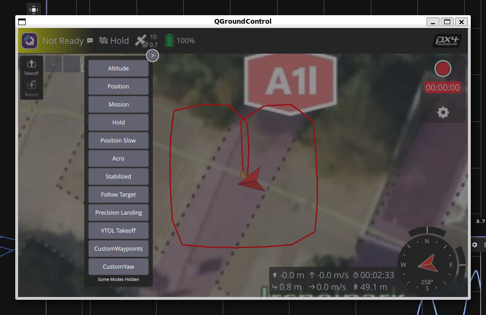
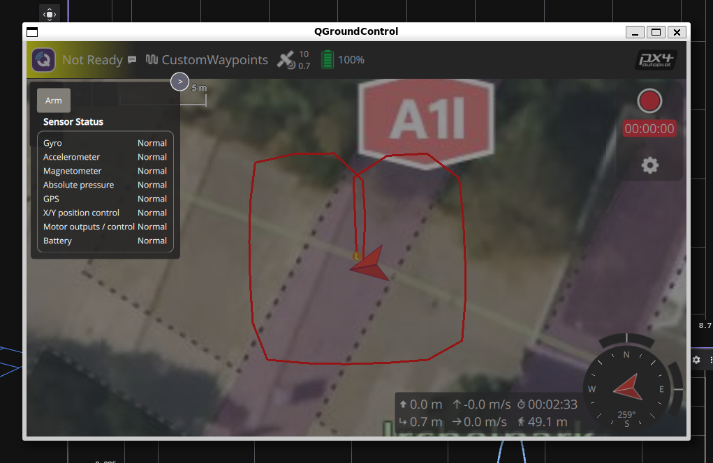

# Custom Mode Demo

This package demonstrates how to create and register a PX4 custom flight mode from ROS 2 using the PX4-ROS2 Interface Library.

## Overview

The Custom Mode Demo registers one mode, **CustomWaypoints**, which flies a predefined rectangular waypoint trajectory when selected in QGroundControl.

## Prerequisites

1. Start the simulation, PX4 and QGC as described in the [setup guide](../../docs/setup.md).
2. Ensure the vehicle is armed (GPS lock, all sensors healthy)
3. Verify QGroundControl connection for mode monitoring

## Usage

1. Start the simulation, PX4 and QGC as described in the [setup guide](../../docs/setup.md).
2. Start the additional ROS 2 node through the [common launchfile](../px4_roscon_workshop/README.md)

   ```sh
   ros2 launch px4_roscon_workshop common.launch.py
   ```

3. Run `custom_mode_demo.launch.py` from inside the docker container

   ```sh
   ros2 launch custom_mode_demo custom_mode_demo.launch.py
   ```

4. The custom mode demo does not automatically switch to _CustomWaypoints_ or arm the drone.

   1. On the QGC window, fist enter _CustomWaypoints_ mode:

      

   2. Then click on the `Not Ready` label and arm the vehicle:

      

The `custom_mode_demo.launch.py` can also start the _MicroXrceAgent_ and the _gz clock bridge_. Set the launch arguments `run_uxrcedds_agent` or `run_gz_clock_bridge` to `true` to run them if you don't use  `common.launch.py`.

