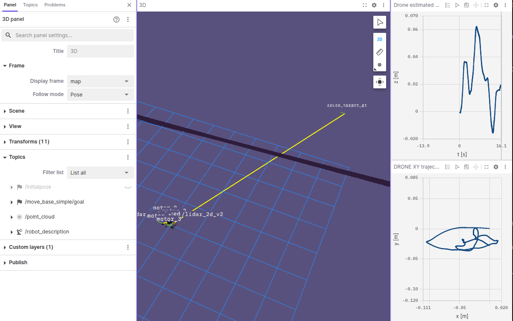

# Teleoperation

This packages offers uses PX4 custom modes and executor to teleop a drone.

## Usage

Launch gz [walls](https://github.com/PX4/PX4-gazebo-models/blob/e05f4312d3f28aa621157610584a4870406cb6d3/worlds/walls.sdf) world, you'll have to navigate inside narrow passages now.

First start the simulation

```sh
make px4_sitl gz_x500_lidar_2d_walls
```

You can now launch the [common](../px4_roscon_workshop/README.md) launchfile

```sh
ros2 launch px4_roscon_workshop common.launch.py
```

and finally the `teleop` launchfile and the _keyboard_monitor_ node.

```sh
ros2 launch teleop teleop.launch.py
```

use the argument `px4_autopilot_path` (default value `'~/PX4-Autopilot'`) to set the path for your PX4 installation.

```sh
ros2 run teleop_twist_rpyt_keyboard teleop_twist_rpyt_keyboard
```

Just like in the Custom Mode demo, the teleop one requires you to manually activate it and arm the drone!
Make sure you launch the maze in Foxglove, more details see [Foxglove Instructions](../px4_roscon_workshop/README.md)

Your output should look like this:



## Exercise

Navigate the drone to the target in Foxglove using teleoperation.
Do not use the Gazebo simulation, rely solely on the LiDAR (laser scan) data for guidance.
Hint: Observe and record a few key waypoints along the path, these will be useful for a subsequent exercise.
https://docs.px4.io/main/en/msg_docs/VehicleLocalPosition
